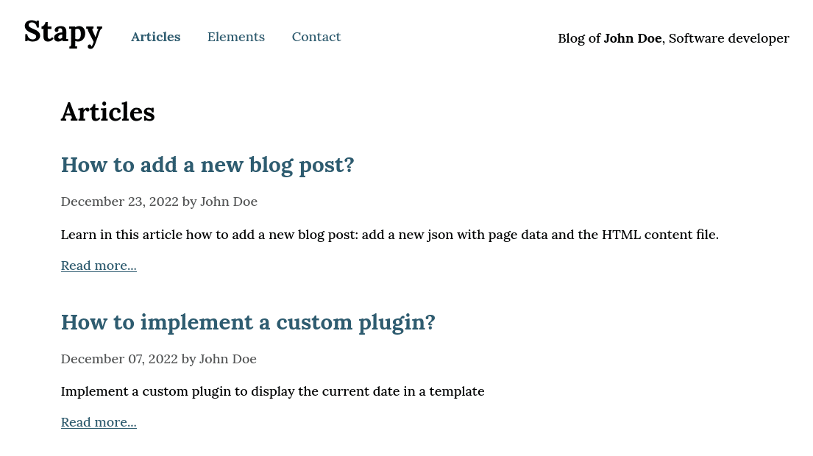

[](https://www.stapy.net/)
[](https://opensource.org/licenses/BSD-2-Clause)
[](https://www.python.org/)
[](https://github.com/PyCQA/pylint)
[](https://builds.sr.ht/~magentix/stapy?)

Stapy is a Static Site Generator. It works with Python on any operating system without additional packages.

Official Website: [www.stapy.net](https://www.stapy.net)



## Requirements

Requires Python 3.6 or newer on any operating system.

## Demo

- [Live default Stapy Theme](https://demo.stapy.net)
- [Stapy Editor (Read Only)](https://demo.stapy.net/_editor)
- [Site built and hosted on SourceHut pages](https://preview.stapy.net)

## Installation

Download the last Stapy release and unzip the archive.

### tar.gz

[stapy-1.17.12.tar.gz](https://www.stapy.net/download/stapy-1.17.12.tar.gz)

```shell
wget https://www.stapy.net/download/stapy-1.17.12.tar.gz
tar zxvf stapy-1.17.12.tar.gz
```

### zip

[stapy-1.17.12.zip](https://www.stapy.net/download/stapy-1.17.12.zip)

```shell
wget https://www.stapy.net/download/stapy-1.17.12.zip
unzip stapy-1.17.12.zip
```

## Serve

Start working on the website by running the HTTP server.

### Unix

```shell
python3 stapy.py
```

Then navigate to the URL `http://127.0.0.1:1985` in your browser.

Serve from custom host and port by adding an argument:

```shell
python3 stapy.py 0.0.0.0:8080
```

**Note:** This involves modifying the base URL in the file `source/layout/common.json`.

**Tip:** Create an alias to quickly start the server for your site:

```shell
alias stapy='python3 /absolute/path/to/stapy.py'
```

### Windows

Double-click on the `stapy.py` file (Python is required, easily install from **Microsoft Store** if needed).

If the `py` files open with an editor, right-click and select: **Open with...** Python 3.X

Then navigate to the URL `http://127.0.0.1:1985` in your browser.

```
=^..^= Welcome to Stapy 1.17.12
Serving under http://127.0.0.1:1985
```

## Build

When the site is ready, build it for publishing.

### Unix

```shell
python3 stapy.py build
```

By default, all environments will be built. The list of environments to build can be added in parameters.

```shell
python3 stapy.py build devel prod
```

### Windows

Double-click on the `build.py` file.

If the `py` files open with an editor, right-click and select: **Open with...** Python 3.X

```
=^..^= Welcome to Stapy 1.17.12
Build in progress...
[prod] 56 pages generated in 0.1456 seconds
[devel] 56 pages generated in 0.1348 seconds
```

## Environments

Static files are generated in the `web` directory. This directory contains all the necessary environment directories (devel, prod...).

For the production, add a `prod` directory in the `web` directory. It will contain all pages and files you need to deploy (html, css, js, images...).

## Resources

All necessary resources like js, css or images are copied from the `source/assets` directory in all environment directories (e.g. `web/prod`).

## Routes

For a page, the server search a json file in `source/pages` directory. The name of the json file is the same as the URL path. Examples:

| URL Path          | Json file                   |
| ----------------- | --------------------------- |
| /                 | index.html.json             |
| /hello.html       | hello.html.json             |
| /hello/world.html | hello/world.html.json       |
| /hello/world/     | hello/world/index.html.json |

### Reserved routes

| Route                        | Result (json)                        |
|------------------------------|--------------------------------------|
| /_pages                      | List all the pages                   |
| /_pages/data                 | List all the pages with the data     |
| /_environments               | List the environments                |
| /_page/hello.html            | Get the data of the given path       |
| /_content/content/hello.html | Get the content of the given file    |
| /_cache/clear                | Manually clear Json query data cache |

## Page data

The page json file contains all the data required to generate the page:

```json
{
  "template": "template/default.html",
  "enabled": true,
  
  "content": "content/index.html",
  
  "meta_title": "Page meta title",
  "meta_description": "Page meta description",
  "title": "Page title"
}
```

- The **template** defines the HTML skeleton file. If missing it will be a blank template with only the block "content".
- The **enabled** key determines whether the page should appear and be generated during the build. If the key is missing, the value is assumed to be **true**.

Other keys are free and used in the template.

Set the environment variables with the environment suffix:

```json
{
  "url.local": "http://127.0.0.1:1985/",
  "url.prod": "https://www.example.com/"
}
```

**The environment suffix must have the same name as your environment directory.** For local server rendering, the suffix is always "local".

A variable can have a default value:

```json
{
  "my_text": "All environments display this text",
  "my_text.prod": "Except the prod with this"
}
```

## Layout

A file named **html.json** in the `source/layout` directory is used for the default html page configuration. It will be merged with the page's json file. This is useful for a global configuration.

**layout/html.json**
```json
{
  "title": "Default title",
  "template": "template/default.html"
}
```

**pages/index.html.json**
```json
{
  "title": "Home title",
  "content": "content/index.html"
}
```

**layout/html.json + pages/index.html.json**
```json
{
  "title": "Home title",
  "template": "template/default.html",
  "content": "content/index.html"
}
```

You can add layout file for any file extensions you need:

* layout/**xml.json**
* layout/**txt.json**
* ...

A `common.json` config file is available for all pages (all extensions).

* layout/**common.json**

Finally, it is possible to add a layout file for the page subdirectories:

* layout/blog/html.json
* layout/blog/2022/html.json

| JSON                                    | Weight | Required |
|-----------------------------------------|--------|----------|
| layout/common.json                      | 1      | N        |
| layout/html.json                        | 2      | N        |
| layout/blog/common.json                 | 3      | N        |
| layout/blog/html.json                   | 4      | N        |
| layout/blog/2022/html.json              | 5      | N        |
| pages/blog/2022/my-first-post.html.json | 6      | Y        |

Json data with higher weight will override and extend lower weights.

**Tip:** Add `_page/` before the path to fetch json merged data.

```
http://127.0.0.1:1985/_page/index.html
http://127.0.0.1:1985/_page/hello.html
```

## Template

The template file is the skeleton of the page:

```html
<!DOCTYPE html>
<html lang="fr">
    <head>
        <meta charset="utf-8">
        <title>{{ meta_title }}</title>
        <meta name="description" content="{{ meta_description }}" />
        <link rel="stylesheet" href="{{ url }}css/style.css" />
    </head>
    <body>
        <header>
            
        </header>
        <main>
            
        </main>
        <footer>
            
        </footer>
    </body>
</html>
```

### Expressions

* All variables enclosed in double curly braces **{{ }}** will be replaced with the value declared in the json file for the var.
* All variables enclosed in curly brace percent **** will be replaced with the content of the file declared in the json file for the var.
* All method names enclosed in curly brace colon **{: :}** will be replaced with the return of the method in a plugin.

**Note:** Escape the brace character to not parse an expression:

```html
\{% block.keep.exp %\}
```

### Child block

Call a child block template declared in page data with **** syntax.

```json
{
  "block.post": "template/block/post.html"
}
```

```html

```

Add arguments to the block:

```html

```

The arguments will be accessible in the **"block.post"** template with a `$` before the var:

```html
Hello {{ $firstname }} {{ $lastname }}!
```

Use specific json data for the child content with a `+` separator (spaces are required):

```html

```

The `json/my-first-post.html.json` data will be accessible in the **"block.post"** template with a `$` before the var:

```html
<a href="{{ url }}{{ $_path }}">{{ $post_title }}</a>
```

To loop json data with a query, use `~` as separator (spaces are required):

```html

```

Example:

```html

```

This query retrieves the pages 1 to 10, with **post** value in **tags** and **published** set to 1, sorted by **date**. The **tags**, **published** and **date** vars must be present in the json data of the pages:

```json
{
  "date": "2022-01-01",
  "published": 1,
  "tags": ["post"]
}
```

The **json** data will be accessible in the **"block.post"** template with a `$` before the var.

Add an optional block separator with the **delimiter** parameter:

```html

```

**Notes:**

The value type must be the same as in the JSON data:

```json
{
  "published": 1
}
```

- published = 1 (int) is **True**
- published = "1" (str) is **False**

```json
{
  "published": "1"
}
```

- published = 1 (int) is **False**
- published = "1" (str) is **True**

Multiline expressions are allowed:

```html

```

A block called in the same block never throws an infinite loop error. The child block is ignored.

## Reserved variables

### List

| Variable      | Description       | Example         |
|---------------|-------------------|-----------------|
| \_path        | Cleaned page path | blog/           |
| \_full_path   | Full page path    | blog/index.html |
| \_env         | Environment name  | prod            |

### Examples

```html
{{ url }}{{ _path }}
<!-- https://www.example.com/blog/ -->
```

```html
{{ url }}{{ _full_path }}
<!-- https://www.example.com/blog/index.html -->
```

```html
<script type="text/javascript" src="{{ url }}js/init.{{ _env }}.js"></script>
<!-- https://www.example.com/js/init.prod.js -->
```

## Plugins

A plugin allows you to add custom code when rendering the page.

| Method                     | Description                                          | Method argument 1               | Method argument 2 (dict)       | Return        |
|----------------------------|------------------------------------------------------|---------------------------------|--------------------------------|---------------|
| file_content_opened        | Update any file content (html, json, md, css, js...) | File content (str or bytes)     | {path, mode, _stapy}           | str or bytes  |
| page_data_merged           | Update the current page json data                    | Page data (dict)                | {path, _stapy}                 | dict          |
| before_content_parsed      | Update the page template content before parsing      | Page content (str)              | {data, env, path, _stapy}      | str           |
| after_content_parsed       | Update the page template content after parsing       | Page content (str)              | {data, env, path, _stapy}      | str           |
| child_content_data         | Update child data before content generation          | Child data (dict)               | {key, env, path, data, _stapy} | dict          |
| child_content_query_result | Update data result before content generation         | All child data (list)           | {key, env, path, data, _stapy} | list          |
| custom_http_response       | Send custom response on a request                    | Response result (tuple or None) | {path, request, _stapy}        | tuple or None |
| http_request_initialized   | Execute an action when HTTP request is initialized   | Current page path               | {_stapy}                       | None          |
| http_request_sent          | Execute an action when HTTP request was sent         | Current page path               | {_stapy}                       | None          |
| ?                          | A free named method called with {: :} syntax         | Page data (dict)                | {env, path, _stapy, ?}         | str           |

A plugin is a free named python script in the `plugins` directory, or a script named `main.py` in a subdirectory:

- plugins/helloworld.py
- plugins/helloworld/main.py

The `_stapy` key in argument 2 contains *StapyFileSystem*, *StapyJsonQuery*, *StapyParser*, *StapyGenerator* and *StapyPlugins* objects.

### Example

To convert Markdown to HTML, add a file `mdtohtml.py` in the `plugins` directory with the following content:

```python
import markdown


def file_content_opened(content: str, args: dict) -> str:
    if args['path'].endswith('.md'):
        return markdown.markdown(content)
    return content

```

```
pip3 install markdown
```

You can now use Markdown syntax in your page content:

```markdown
Hello World!

[Back to home]({{ url }})
```

### Custom method

In any template file, call a free named method with curly brace colon **{: :}** syntax.

#### Search for method in all plugins:

```html
{: my_plugin_method :}
```

#### Execute method only in the specified plugin:

```html
{: custom.my_plugin_method :}
```

The plugin name is the plugin file name without the `.py` extension or the plugin directory name.

**custom.my_plugin_method** means to display **my_plugin_method** result from the `plugins/custom.py` or `plugins/custom/main.py` script.

```python
# plugins/custom.py

def my_plugin_method(data: dict, args: dict) -> str:
    return '<strong>Hello World!</strong>'
```

Add arguments to the method:

```html
{: custom.my_plugin_method firstname:"John" lastname:"Doe" :}
```

```python
# plugins/custom.py

def my_plugin_method(data: dict, args: dict) -> str:
    return '<strong>Hello ' + args['firstname'] + ' ' + args['lastname'] + '</strong>'
```

Method arguments are optional when you don't need them:

```python
# plugins/custom.py

def my_plugin_method() -> str:
    return '<strong>Hello World!</strong>'
```

### Protected methods

All methods other than the custom plugin method should be prefixed by underscore. They can never be called in a template.

```python
# plugins/custom.py

def custom_plugin_method(data: dict, args: dict) -> str:
    return _my_method(data)
    
def _my_method(data: dict) -> str:
    return '<strong>Hello World!</strong>!'

```

```html
{: custom_plugin_method :} <!-- OK -->
{: _my_method :} <!-- Forbidden -->
```

## Deployment

All the files in your production environment (e.g. `web/prod`) must be exposed.

* On a classic hosting, you can send the `web/prod` directory content by SFTP.
* On an automated deployment tool like Netlify, Cloudflare Pages or Vercel, you need to create a repository on GitHub and push the files (Only push the `web/prod` content or all the Stapy files and configure the tool to deploy the production environment directory).
* With GitHub Pages you can use GitHub Actions to build and deploy the website (Push the Stapy files without the `web` directory and add steps in the workflow to create `web/prod` and build the site).

## Safe mode

Stapy can be hosted on a remote server (as a proxy behind Apache) and used by multiple users for shared work.

In this case, we recommend protecting the editor with a "htpasswd" and using Stapy safe mode to hide error messages (error messages may contain the absolute path of a file).

To enable the safe mode, add an empty `secure` flag at the Stapy root:

```shell
touch secure
```

## Bug Tracking

For any question or bug report, please add a ticket: 

[Bug Tracking](https://todo.sr.ht/~magentix/stapy)

## Themes

Themes for Stapy:

* [Simple](https://git.sr.ht/~magentix/stapy-simple/)
* [Pure](https://git.sr.ht/~magentix/stapy-pure/)
* [Search](https://git.sr.ht/~magentix/stapy-search/)
* [CheerUp](https://git.sr.ht/~magentix/stapy-cheerup/)
* [Garden](https://git.sr.ht/~magentix/stapy-garden/)
* [Arctic](https://git.sr.ht/~magentix/stapy-arctic/)
* [Dusk](https://git.sr.ht/~magentix/stapy-dusk/)
* [Breeze](https://git.sr.ht/~magentix/stapy-breeze/)